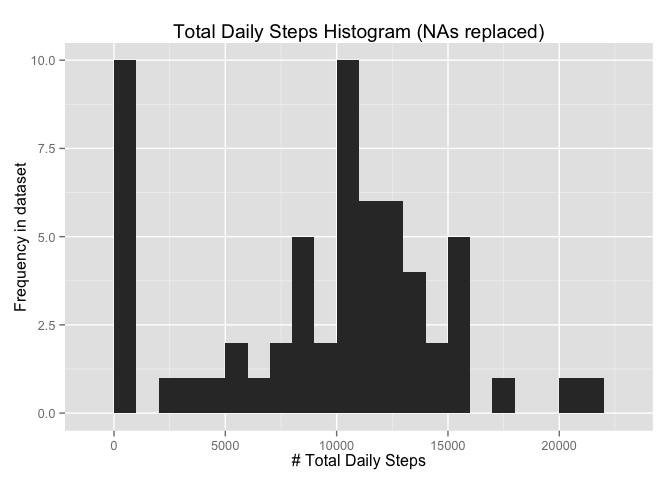
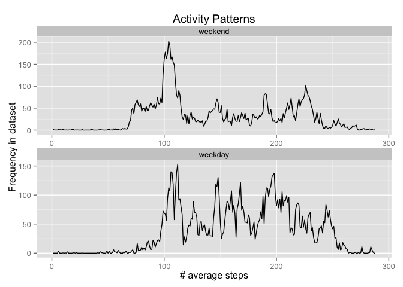

# Reproducible Research: Peer Assessment 1
pi-georgia  
September 14, 2015  
#Overview
It is now possible to collect a large amount of data about personal movement using activity monitoring devices. 
This assignment makes use of data from a personal activity monitoring device that collects data at 5 minute intervals through out the dayand investigates:  
1. investigates daily activity pattern.  
2. evaluates impact of missing data.  
3. compares activity pattern in weekdays versus weekands.  
*The data consists of two months of data from an anonymous individual collected during the months of October and November, 2012 and include the number of steps taken in 5 minute intervals each day.*


### Loading and preprocessing the data


```r
dataset <- read.csv("activity.csv")
```

### Mean total number of steps taken per day
First I will calculate the total number of steps taken each day and plot a histogram of the total number of steps taken each day. Then I will calculate and report the **mean** and **median** total number of steps taken per day

```r
library(dplyr)
daily <- group_by(dataset, date) 
#calculate sums of steps by date
dailysum<- summarize(daily,total_steps= sum(steps, na.rm=TRUE))
#make a histogram : I will choose a binwidth that is at a scale relevant to the daily sum of steps, by choice 1000
library(ggplot2)
ggplot(dailysum, aes(x=total_steps, fill='violet')) + geom_histogram(binwidth =1000) +labs( title="Total Daily Steps Histogram", y="Frequency in dataset", x="# Total Daily Steps")
```

 

```r
mn<- mean(dailysum$total_steps) ; mn<- round(mn, 2)
md<- median(dailysum$total_steps)
```

The mean number of steps taken each day is  **9354.23** and the median number of steps taken each day is **10395**.   

### Average daily activity pattern

To visualize the daily activity pattern, here is a time series plot  of the 5-minute interval (x-axis) and the average number of steps taken, averaged across all days (y-axis).


```r
interval <- group_by(dataset,as.factor( interval)) %>% summarize(daily_avg_steps=mean(steps, na.rm=TRUE))
names(interval)[1]<-"interval_class"
qplot(as.integer(interval$interval_class), interval$daily_avg_steps,main="Activity Pattern, across a day (avg)", ylab="# of Steps, on average", col= "violet",geom="line", xlab="5 minute interval" )
```

 

Next I will identify **which 5-minute interval**, on average across all the days in the dataset, contains the **maximum number of steps**. I can see from the plot this is somewhere in the [800,1000] zone, yet I can get the exact value with the following calculation


```r
max_act_int<- interval$interval_class[interval$daily_avg_steps==max(interval$daily_avg_steps)]
```
The 5-minute interval that on average across all the days in the dataset contains the maximum number of steps is  
the **835 th **

### Handling missing values (NAs)
To exclude bias introduced by NAs, I will clean-up my missing values after calculating how many of them exist.

```r
x<- sum(is.na(dataset))
```
There are **2304** missing values in my dataset.
   
To fill in  all of the missing values in the dataset, I will use the daily mean to fill-in the missing data.  To do so I will indentify NA position and replace their value with the mean of the day from the respective daily mean table.


```r
#get the indexes where NAs are located in the dataset, "index"    
index<- which(is.na(dataset)) ; i<-1
dailymean<- summarize(daily,avg_steps= mean(steps, na.rm=TRUE))
# are there any NAs still remaining in the table of means? Making an index with NA positions in the dataframe of daily means, "index2"
index2<- which(is.na(dailymean[,2]))
# yes, so I will replace them with 0 
dailymean[index2,2]<-0
#start building the timeseries where NAs are replaced with daily mean values
timeseries<-dataset
for (i in 1:length(index)) 
  {
#making an temporary index ("index3") to match the date for every NA measurement and get the mean for it from the relevant table
    index3<-  which(timeseries[index[i],2]==dailymean$date)
    timeseries[index[i],1]<-dailymean[index3,2] 
   }   
```
   
###Re-evaluate mean and median of total steps per day
Next I will make a histogram of the total number of steps taken each day and Calculate and report the **mean** and **median** total number of steps taken per day.


```r
total_timeseries<- group_by(timeseries, date=as.factor(date)) %>% summarize(total_steps=sum(steps, na.rm=TRUE))
ggplot(total_timeseries, aes(x=total_steps)) + geom_histogram(binwidth =1000) +labs( title="Total Daily Steps Histogram (NAs replaced)", y="Frequency in dataset", x="# Total Daily Steps")
```

 

```r
#Calculate new mean/median and their % change vs previous values
mnn<- mean(total_timeseries$total_steps) ; mdn<- median(total_timeseries$total_steps)
mean_change<- (mnn/mn-1)*100 ; median_change<- (mdn/md-1)*100
```

The new mean is ** 9354.23 ** while previously it was ** 9354.23 **.  
The new median is ** 1.0395\times 10^{4} ** while previously it was ** 1.0395\times 10^{4} **.  
I see that the change is practically zero, the mean has changed by **-5\times 10^{-6} ** %  and median has changed by ** 0 ** % .

### Activity patterns comparison between weekdays and weekends

To understand if there are any **differences in activity patters between weekdays and weekends**, first I will manipulate my dataset, regrouping the steps by a new factor variable with two levels -- "weekday" and "weekend" mapped on the dates.  
Then I  will make a panel plot containing a time series plot  of the 5-minute interval (x-axis) and the average number of steps taken, averaged across all weekday days or weekend days (y-axis). 


```r
#remake my data set
WE <-c("Saturday", "Sunday")
w_series<- mutate(timeseries, weekday= weekdays(as.Date(date)), w_class = factor(1*(weekday %in% WE), labels=c("weekend", "weekday")))
ww<- group_by(w_series, w_class=as.factor(w_class), interval=as.factor(interval)) %>% summarize(avg_steps=mean(steps, na.rm=TRUE))

# Plot the activity patterns
ggplot(data=ww,aes(x=as.integer(interval),y=avg_steps)) + facet_wrap(~w_class, scales="free",  nrow = 2)+geom_line() + labs( title="Activity Patterns", y="Frequency in dataset", x="# average steps")
```

 

###Conclusions
Step activity peaks in the beggining and the middle of the day. 
Activity patterns are notably different during weekends vs weekdays, as people see to move more and more evenly throughout the day during weekends.
