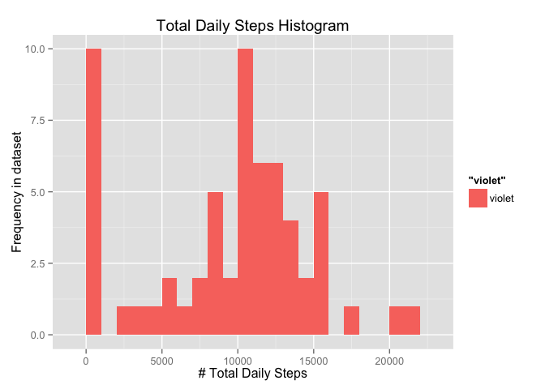
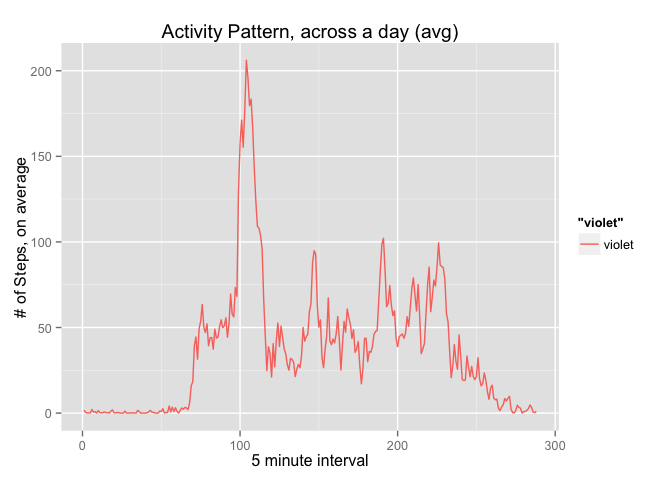

# Reproducible Research: Peer Assessment 1
pi-georgia  
#Overview


## Loading and preprocessing the data


```r
dataset <- read.csv("activity.csv")
```

## What is mean total number of steps taken per day?

  1. Make a histogram of the total number of steps taken each day
  2. Calculate and report the **mean** and **median** total number of steps taken per day

```r
      library(dplyr)
```

```
## Warning: package 'dplyr' was built under R version 3.1.3
```

```
## 
## Attaching package: 'dplyr'
## 
## The following objects are masked from 'package:stats':
## 
##     filter, lag
## 
## The following objects are masked from 'package:base':
## 
##     intersect, setdiff, setequal, union
```

```r
      daily <- group_by(dataset, date) 
      #calculate sums of steps by date
      dailysum<- summarize(daily,total_steps= sum(steps, na.rm=TRUE))
    #make a histogram : I will choose a binwidth that is at a scale relevant to the daily sum of steps, by choice 1000
    library(ggplot2)
    ggplot(dailysum, aes(x=total_steps)) + geom_histogram(binwidth =1000) +labs( title="Total Daily Steps Histogram", y="Frequency in dataset", x="# Total Daily Steps")
```

 

```r
mn<- mean(dailysum$total_steps) ; mn<- round(mn, 2); 
md<- median(dailysum$total_steps); 
```

The mean number of steps taken each day is  **9354.23** and the median number of steps taken each day is **10395**

## What is the average daily activity pattern?

1. Make a time series plot (i.e. `type = "l"`) of the 5-minute interval (x-axis) and the average number of steps taken, averaged across all days (y-axis)

```r
interval <- group_by(dataset,as.factor( interval)) %>% summarize(daily_avg_steps=mean(steps, na.rm=TRUE))
names(interval)[1]<-"interval_class"

plot(interval$interval_class, interval$daily_avg_steps,main="Activity Pattern, across a day (avg)", ylab="# of Steps, on average",xlab="5 minute interval" , type="l")
```

 

Next I will identify which 5-minute interval, on average across all the days in the dataset, contains the maximum number of steps.

```r
#I can see from the plot this is somewhere in the [800,1000] zone, yet I can get the exact value with 
max_act_int<- interval$interval_class[interval$daily_avg_steps==max(interval$daily_avg_steps)]
```
The 5-minute interval that on average across all the days in the dataset contains the maximum number of steps is  
the **835th **

## Imputing missing values
Note that there are a number of days/intervals where there are missing
values (coded as `NA`). The presence of missing days may introduce
bias into some calculations or summaries of the data.

    1. Calculate and report the total number of missing values in the dataset (i.e. the total number of rows with `NA`s)
    
    ```r
     x<- sum(is.na(dataset))
    paste("# of NAs =", x)
    ```
    
    ```
    ## [1] "# of NAs = 2304"
    ```
    2. To fill in  all of the missing values in the dataset, since the variation during a day is large, I will use a moving average of past 3 5-minute intervals. 
     3. Create a new dataset that is equal to the original dataset but with the missing data filled in.
     
    
    ```r
    #get the indexes where NAs are located in the dataset, "index"    
    index<- which(is.na(dataset))
    i<-1
    dailymean<- summarize(daily,avg_steps= mean(steps, na.rm=TRUE))
    # are there any NAs still remaining in the table of means? Making an index with NA positions in the dataframe of daily means, "index2"
    index2<- which(is.na(dailymean[,2]))
    # yes, so I will replace them with 0 
    dailymean[index2,2]<-0
    #start building the timeseries filled with mean daily values
    timeseries<-dataset
    for (i in 1:length(index)) 
      {
    #making an temporary index ("index3") to match the date for every NA measurement and get the mean for it from the relevant table
    index3<-  which(timeseries[index[i],2]==dailymean$date)
    timeseries[index[i],1]<-dailymean[index3,2] 
       }   
    ```
   

    4. Make a histogram of the total number of steps taken each day and Calculate and report the **mean** and **median** total number of steps taken per day. Do these values differ from the estimates from the first part of the assignment? What is the impact of imputing missing data on the estimates of the total daily number of steps?


```r
total_timeseries<- group_by(timeseries,date=as.factor(date)) %>% summarize(total_steps=sum(steps, na.rm=TRUE))

 ggplot(total_timeseries, aes(x=total_steps)) + geom_histogram(binwidth =1000) +labs( title="Total Daily Steps Histogram", y="Frequency in dataset", x="# Total Daily Steps")
```

 

```r
mnn<- mean(total_timeseries$total_steps); paste("new mean =", round(mnn,2))
```

```
## [1] "new mean = 9354.23"
```

```r
mdn<- median(total_timeseries$total_steps); paste("new median =", mdn)
```

```
## [1] "new median = 10395"
```

```r
mean_change<- (mnn/mn-1)*100 ; paste("mean has changed by ", round(mean_change,6), "%")
```

```
## [1] "mean has changed by  -5e-06 %"
```

```r
median_change<- (mdn/md-1)*100; paste("median has changed by ", median_change, "%")
```

```
## [1] "median has changed by  0 %"
```


## Are there differences in activity patterns between weekdays and weekends?


1. Create a new factor variable in the dataset with two levels -- "weekday" and "weekend" indicating whether a given date is a weekday or weekend day.

1. Make a panel plot containing a time series plot (i.e. `type = "l"`) of the 5-minute interval (x-axis) and the average number of steps taken, averaged across all weekday days or weekend days (y-axis). The plot should look something like the following, which was created using **simulated data**:

```r
w_series<- mutate(timeseries, weekday= weekdays(as.Date(date)), w_class = factor(1 * (weekday =="Saturday" || weekday =="Sunday")))
ww<- group_by(w_series, w_class=as.factor(w_class), interval=as.factor(interval)) %>% summarize(avg_steps=mean(steps, na.rm=TRUE))

# Plot the activity patterns
ggplot(data=ww,aes(x=interval,y=avg_steps)) +
    geom_point(colour='red') +
    facet_wrap(~w_class, scales="free",  nrow = 2) +labs( title="Activity Patterns", y="Frequency in dataset", x="# average steps")
```

 
